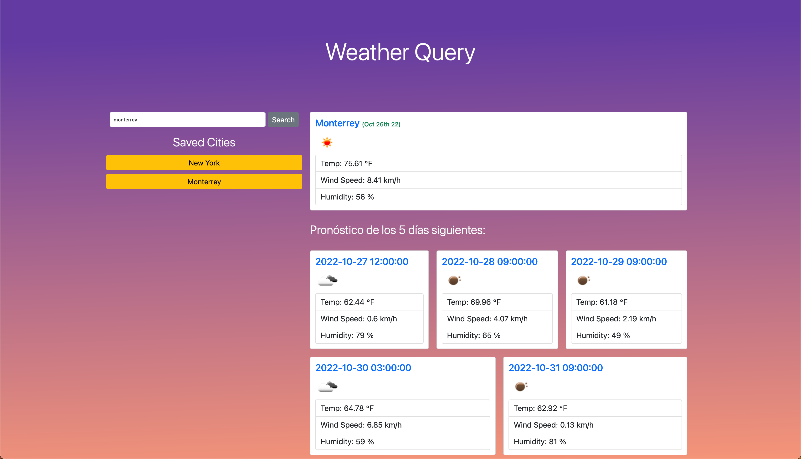

# Weather Query App

Es una aplicación de consulta sobre los pronósticos del clima en diferentes
ciudades del mundo. Dedicado para los viajeros que les gustaría saber de las condiciones
del clima a la ciudad a la que viajan.

### Puntos Clave

- Búsqueda la ciudad de preferencia.
- Se arroja la información del clima actual y de los próximos 5 días.
- La información solicitada se guarda por ciudad.

### Creador

- [@djonguitud](https://www.github.com/djonguitud)

## Demo

- [Visita la página web, haciendo click aqui!](https://djonguitud.github.io/weather-query/)

## Screenshot

)

## Tecnologías implementadas

## Preguntas o sugerencias

Contáctame a mi email: djonguitud95@gmail.com
